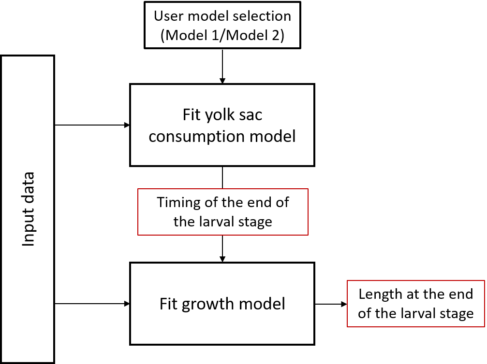

# LEG: Predicting end of larval period for grayling

LEG tool is a modelling approach for lab-raised European Grayling _Thymallus thymallus_ to predict when an individual will end the larval period and it's length at that point. The repository contains the LEGtool, a data folder that your data will go in, and a models folder containing the three models the tool uses.

Details of the tool are available in Palejowski et al. (_in prep_)

## Getting started

### Prerequisites

The LEGtool was developed using R version 4.0.2.
It uses the following packages that will be needed to run it:
 - tibble version 3.0.4
 - readr version 1.4.0

### Usage

To use the tool download the code from the main LEG repository via Download ZIP. Your data must be formatted as a .csv file named DATAFRAME.csv and placed in the data/ directory following the formatting details given in the README.md file there. The tool can then either be run from within R line by line or from the command line. A flow-through user diagram is below.

Palejowski et al (_in prep_) developed two models of yolk sac consumption, model 1 (linear relationship between time and yolk sac consumption, simpler but slightly less accurate) and model 2 (non-linear relationship, more complex but more accurate). Model 1 is used by default, but can be changed in the R script by changing which model is used for "timing_predictor" in line 39.

The tool generates the following outputs:

| Output | Description | 
| --- | --- |
| DATAFRAME_predicted.csv | The original input DATAFRAME.csv file but with two added columns of predicted lengths at larval period end, and of predicted time of larval period end in days post fertilisation. |
| histogram_of_predicted_times.png | A histogram of the predicted timings of end of larval period, saved as a .png file. |
| histogram_of_predicted_lengths.png | A histogram of the predicted lengths at end of larval period, saved as a .png file. |

These will all be saved in a folder called LEG/outputs/ which will be created if one does not already exist.

DISCLAIMER: as with all predictive models, this tool will predict well if the input variables are within the range used to train the original model, outside of the below ranges predictions cannot be trusted:
 - fish length at hatching: 8.419-10.677 mm
 - number of days taken to hatch: 30-38
 - yolk sac volume at hatching: 5.5-11.9 mm^3
 - length of experiment: 30-70 days post-fertilisation

## Citing

_Describe how to cite your work, typically this is something you can update once your paper is complete and in a journal. You can replace this with a "todo" or reference your preprint in the meantime. Or just state the authors, idk_

The paper is currently in preparation. This section will be updated when it is citable.

## License

Usage is provided under the [MIT License](https://github.com/HugoPal/LEG/blob/main/LICENSE).
